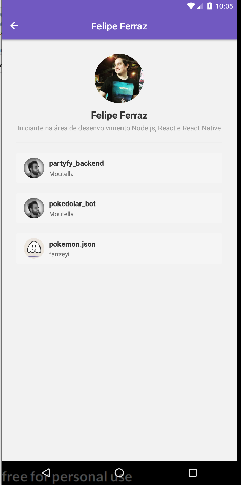

<h3 align="center">
  Go Stack - Desafio 6: Primeiro projeto com ReactJS Native
</h3>

<h1 align="center">
  
</h1>

### Funcionalidades

Aplicação Mobile que busca usários na API do Github, assim salvando eles no dispositivo e mostrando os usuários salvos em uma lista exibindo a BIO cadastrada no Github e um botão para mostrar mais detalhes.
Na Janela de mais detalhes é exibido todos os projetos que usuário marcou como "star" e seus respectivos desenvolvedores.

#### Funções Adicionadas

1. Loading de repositórios
Adicionado um indicator de loading utilizando <ActivityIndicator /> antes de carregar a lista de repositórios favoritados na tela de detalhes do Usuário.

2. Scroll infinito
Adicionado scroll infinito na lista de repositórios favoritados. Assim que o usuário chegar nos 20% do final de lista, busca pelos items na próxima página e adicione na lista

3. Pull to Refresh
Adiciona a funcionalidade para quando o usuário arrastar a listagem de repositórios favoritados pra baixo atualize a lista resetando o estado itens.

4. WebView
Página na aplicação que vai ser acessada quando o usuário clicar em um repositório favoritado. O conteúdo da página é uma WebViewque exibe o atributo html_url presente no objeto do repositório que vem da API do Github.

#### Prints

<h1 align="center">
 
  
</h1>

<h1 align="center">
  
  </h1>