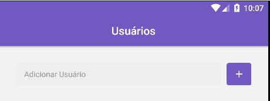
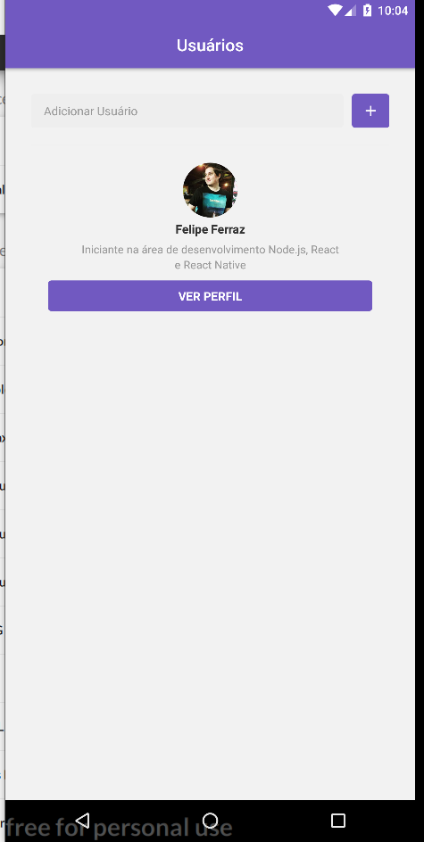

<h3 align="center">
  Go Stack - Desafio 6: Primeiro projeto com ReactJS Native
</h3>

<h1 align="center">
  
</h1>

### Funcionalidades

Aplicação Mobile que busca usários na API do Github, assim salvando eles no dispositivo e mostrando os usuários salvos em uma lista exibindo a BIO cadastrada no Github e um botão para mostrar mais detalhes.
Na Janela de mais detalhes é exibido todos os projetos que usuário marcou como "star" e seus respectivos desenvolvedores.

#### Prints

<h1 align="center">
  
</h1>

<h1 align="center">
  
</h1>
